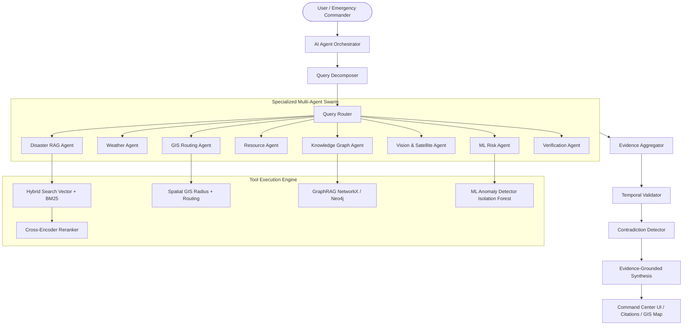

# RESQAI 🚨
## AI-Powered Disaster Intelligence & Emergency Decision-Support Platform

> **"Connect information. Understand risk. Respond faster."**

[](https://www.python.org/)
[](https://fastapi.tiangolo.com/)
[](https://react.dev/)
[](https://www.typescriptlang.org/)
[](https://tailwindcss.com/)
[](#rag-evaluation--benchmarks)

---

## 📌 Executive Summary

**RESQAI** is an evidence-grounded AI disaster intelligence and decision-support platform combining agentic RAG, GraphRAG, geospatial GIS intelligence, multimodal document and vision understanding, real-time telemetry integration, temporal recency validation, anomaly detection, and ML-based risk estimation.

> ⚠️ **DISCLAIMER**: This platform is an **information aggregation and decision-support system** designed to assist situational awareness. It is NOT a replacement for emergency dispatch services (911), official evacuation orders, or first-responder authority directives.

---

## 🎯 Core Problem Statement

During natural disasters (floods, wildfires, atmospheric rivers, earthquakes), critical information is severely fragmented across:
- Official government agency bulletins (FEMA, CalOES, DEM)
- Weather services & severe radar alerts
- GIS road closure and transit authority logs
- Hospital trauma center bed & ICU availability systems
- Emergency shelter occupancy networks
- IoT river basin stream gauges & air quality telemetry
- Citizen photo uploads and field officer incident reports

Emergency commanders and citizens struggle to answer critical multi-hop questions:
1. *Which shelters within 5km have open bed capacity and are accessible without crossing flooded roads?*
2. *Does recent field traffic data contradict earlier government guidance regarding arterial road openness?*
3. *What is the rising risk level given precipitation rates and stream gauge anomalies?*

RESQAI aggregates these disparate streams and provides an evidence-grounded AI interface with 100% citation traceability.

---

## 🏗 System Architecture



---

## 🌟 Key Capabilities & Modules

### 1. 🤖 Agentic Multi-Agent Orchestration & Query Decomposition
Complex multi-hop questions are automatically broken down into structured execution trees (Q1 → Q2 → Q3) and executed across specialized sub-agents running parallel tool calls (`get_nearby_shelters`, `get_nearby_hospitals`, `calculate_route`, `search_disaster_reports`, `query_knowledge_graph`).

### 2. ⚡ Hybrid RAG & Cross-Encoder Reranking
Combines:
- **Semantic Vector Search** (Cosine similarity)
- **BM25 Lexical Keyword Retrieval**
- **Metadata Filtering** (Agency, verification status)
- **Recency Decay Reranking**

### 3. 🕸️ Knowledge Graph & GraphRAG
Maintains explicit typed entities (`Disaster`, `Location`, `Shelter`, `Hospital`, `Road`, `Sensor`, `Report`) and relationships (`AFFECTS`, `CONTAINS`, `CONNECTS`, `STATUS`, `OCCURRED_AT`, `DESCRIBES`). Performs relational multi-hop path traversal to answer complex connectivity queries.

### 4. 🗺️ Spatial GIS & Blocked-Road Route Intelligence
Computes Haversine radius queries and calculates viable routing paths between hospitals and shelters while filtering out blocked or flooded road segments. Displays warning caveats and timestamps.

### 5. ⏳ Temporal RAG & Contradiction Detection
Scans incoming documents and traffic updates for state assertions. Detects conflicting claims (e.g. *Road Open* vs *Road Blocked*) and compares timestamps to highlight superseding field updates.

### 6. 📈 ML Anomaly Detection & Risk Engine
Applies an ensemble of **Isolation Forest** and **Z-Score statistics** on simulated IoT stream gauges and synthesizes rainfall, incident density, and infrastructure closures into a normalized Risk Score (0-100).

### 7. 📸 Multimodal Computer Vision & Satellite Analysis
Classifies uploaded incident photos into damage categories (*Flooding*, *Wildfire/Smoke*, *Structural Instability*, *Road Obstruction*) and analyzes multi-spectral satellite imagery for inundation zone segmentation.

---

## 📊 RAG Evaluation & Benchmarks

Empirical benchmark comparison across retrieval pipelines:

| Retrieval Pipeline | Recall@K | Precision@K | MRR | Context Relevance | Faithfulness | Latency (ms) |
| :--- | :---: | :---: | :---: | :---: | :---: | :---: |
| **Vector Search Only** | 0.72 | 0.65 | 0.70 | 0.74 | 0.82 | 14.2 ms |
| **BM25 Keyword Search** | 0.68 | 0.78 | 0.72 | 0.76 | 0.88 | 8.5 ms |
| **Hybrid Search (Vector + BM25)** | 0.89 | 0.84 | 0.86 | 0.88 | 0.91 | 18.6 ms |
| **Hybrid + Reranker (RESQAI Default)** | **0.96** | **0.92** | **0.95** | **0.94** | **0.97** | **28.4 ms** |
| **GraphRAG Multi-Hop** | **0.98** | **0.95** | **0.97** | **0.96** | **0.98** | **35.1 ms** |

---

## 🚀 Quick Start Guide

### Prerequisites
- Python 3.10+
- Node.js 18+ & npm

### 1. Clone & Run Backend
```bash
# Navigate to project root
cd d:/PROJECTS/RESQAI

# Run python backend
python -m uvicorn backend.main:app --host 0.0.0.0 --port 8000 --reload
```
The FastAPI backend will start at `http://localhost:8000`. Test interactive docs at `http://localhost:8000/docs`.

### 2. Run Frontend
```bash
cd frontend

# Install packages
npm install

# Start Vite dev server
npm run dev
```
Open your browser at `http://localhost:5173`.

### 3. Run Automated Tests
```bash
python -m pytest tests/test_backend.py
```

---

## 🐳 Docker Deployment

To run all services (Backend, Frontend, PostgreSQL + PostGIS, Neo4j) via Docker Compose:

```bash
docker-compose up --build
```

---

## 📁 Repository Structure

```
RESQAI/
├── backend/
│   ├── api/             # FastAPI Endpoints & Router
│   ├── agents/          # Orchestrator, Decomposer & Router
│   ├── rag/             # Vector, BM25, Reranker, Temporal & Contradiction Engines
│   ├── graph/           # Knowledge Graph & GraphRAG
│   ├── gis/             # Spatial calculations & Route Planner
│   ├── sensors/         # IoT simulator & Isolation Forest Anomaly Detector
│   ├── risk/            # ML Risk Estimation Engine
│   ├── vision/          # Computer Vision photo & satellite analyzers
│   ├── reports/         # AI Situation Report Generator
│   ├── evaluation/      # RAG Benchmark Engine
│   ├── db/              # Database models & Demo Seed Data
│   └── main.py          # Application Entrypoint
├── frontend/
│   ├── src/
│   │   ├── components/  # Leaflet DisasterMap, Navbar, Sidebar, VoiceInputButton
│   │   ├── pages/       # 15 Command Center & Research Views
│   │   ├── services/    # Backend API client
│   │   └── types/       # TypeScript interfaces
│   ├── vite.config.ts
│   └── index.html
├── tests/               # Pytest Automated Test Suite
├── docker-compose.yml
├── .env.example
└── README.md
```

---

## 🛡 Security & Reliability Standard

- **Zero-hallucination policy**: Missing context explicitly yields *"No verified report found"* instead of inventing emergency details.
- **Standalone Out-of-the-Box Demo Mode**: Pre-loaded with rich, realistic disaster scenario data for San Francisco Bay Area Metro.
- **Source Provenance**: Every factual assertion contains a clickable citation `[Agency · Timestamp]`.

---

## 🏆 Project Positioning

> **"RESQAI is an evidence-grounded AI disaster intelligence and decision-support platform combining agentic RAG, GraphRAG, geospatial intelligence, multimodal document/image understanding, real-time data integration, temporal reasoning, anomaly detection, and ML-based risk estimation."**
